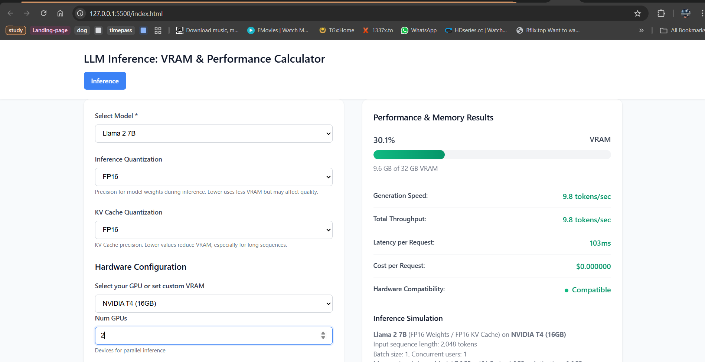

# LLM Inference Calculator

A comprehensive web-based calculator for estimating Large Language Model (LLM) inference costs, latency, and memory usage. This tool helps developers and researchers make informed decisions about LLM deployment configurations.



## Features

- **Memory Usage Calculation**: Accurate VRAM estimation including model weights, KV cache, and activations
- **Performance Modeling**: Generation speed, throughput, and latency predictions
- **Cost Analysis**: Local deployment vs cloud API cost comparisons
- **Hardware Compatibility**: Real-time compatibility checking for different GPU configurations
- **Multiple Models**: Support for Llama 2, Mixtral, GPT-4, and custom models
- **Quantization Support**: FP32, FP16, INT8, and INT4 precision options
- **Use Case Templates**: Pre-configured settings for common applications

## Supported Models

- **Llama 2 7B/13B/70B**: Meta's open-source language models
- **Mixtral 8x7B**: Mistral AI's mixture of experts model
- **GPT-4**: OpenAI's large language model (estimated parameters)
- **Custom Models**: Define your own model parameters

## Supported Hardware

- NVIDIA T4 (16GB)
- NVIDIA A100 (40GB/80GB)
- NVIDIA H100 (80GB)
- RTX 4090 (24GB)
- Custom GPU configurations

## Quick Start

### Web Interface

1. Open `index.html` in your web browser
2. Select a model from the dropdown
3. Choose your GPU configuration
4. Adjust batch size, sequence length, and other parameters
5. View real-time calculations and recommendations

### Python Backend

```python
from calculator import LLMInferenceCalculator

calc = LLMInferenceCalculator()

# Analyze a configuration
result = calc.analyze_configuration(
    'llama-7b', 'a100-40gb',
    batch_size=8, 
    sequence_length=2048, 
    concurrent_users=4
)

print(f"Memory Usage: {result['memory_usage']['total']:.1f} GB")
print(f"Generation Speed: {result['performance']['generation_speed']:.1f} tokens/sec")
print(f"Cost per Request: ${result['cost_per_request']:.6f}")
```

## Installation

### Prerequisites

- Python 3.8+ (for backend calculations)
- Modern web browser (for frontend interface)

### Setup

1. Clone the repository:
```bash
git clone url
cd llm-inference-calculator
```

2. Install Python dependencies:
```bash
pip install -r requirements.txt
```

3. Open the web interface:
```bash
# Simply open index.html in your browser
# Or serve with Python for local development
python -m http.server 8000
```

## Project Structure

```
llm-inference-calculator/
├── index.html          # Main web interface
├── style.css           # Styling and responsive design
├── script.js           # Frontend JavaScript logic
├── calculator.py       # Python backend calculations
├── requirements.txt    # Python dependencies
├── README.md          # This file
└── examples/          # Example configurations
    ├── chatbot.py     # Chatbot configuration example
    ├── summarization.py # Document summarization example
    └── classification.py # Batch classification example
```

## Technical Details

### Memory Calculation Formula

The calculator uses the following formula for total VRAM usage:

```
Total VRAM = Model Weights + KV Cache + Activations + Framework Overhead
```

Where:
- **Model Weights**: `Parameters × Precision × (1/num_gpus)`
- **KV Cache**: `2 × Precision × Layers × Hidden_Size × Sequence_Length × Batch_Size`
- **Activations**: `Batch_Size × Sequence_Length × Hidden_Size × 4`
- **Framework Overhead**: `20% of (Model + KV Cache + Activations)`

### Performance Modeling

Performance is estimated using memory bandwidth as the primary bottleneck:

```
Effective Tokens/Sec = (Memory_Bandwidth / Bytes_Per_Token) × Efficiency_Factors
```

Efficiency factors include:
- Batch size efficiency (diminishing returns)
- Model size efficiency
- Quantization efficiency
- Multi-GPU communication overhead

### Cost Modeling

Three deployment modes are supported:

1. **Local Deployment**: Hardware amortization + power costs
2. **Cloud Deployment**: GPU instance pricing
3. **Hosted APIs**: Per-token pricing models

## Use Cases

### Chatbot Applications
- **Requirements**: Low latency (<1 second), moderate throughput
- **Recommended**: Llama 7B on A100 40GB or T4 with quantization
- **Configuration**: Batch size 1-4, Sequence length 2K-4K

### Document Summarization
- **Requirements**: High throughput, moderate latency tolerance
- **Recommended**: Llama 13B or larger on A100 80GB
- **Configuration**: Batch size 8-16, Sequence length 8K-16K

### Batch Classification
- **Requirements**: Maximum throughput, latency-tolerant
- **Recommended**: Fine-tuned smaller models on multiple GPUs
- **Configuration**: Large batch sizes, shorter sequences

## API Reference

### Python Calculator

#### `LLMInferenceCalculator.analyze_configuration(model, hardware, **kwargs)`

Analyzes a complete inference configuration.

**Parameters:**
- `model` (str): Model name ('llama-7b', 'llama-13b', etc.)
- `hardware` (str): Hardware name ('t4-16gb', 'a100-40gb', etc.)
- `batch_size` (int): Batch size (default: 1)
- `sequence_length` (int): Input sequence length (default: 2048)
- `concurrent_users` (int): Number of concurrent users (default: 1)
- `num_gpus` (int): Number of GPUs (default: 1)
- `inference_quantization` (str): Weight precision ('fp16', 'int8', etc.)
- `kv_cache_quantization` (str): KV cache precision
- `deployment_mode` (str): 'local', 'cloud', or 'hosted'
- `enable_offloading` (bool): Enable CPU/RAM offloading

**Returns:**
Dictionary with memory usage, performance metrics, costs, and compatibility analysis.

## Validation and Accuracy

The calculator's formulas are based on:
- Published research on transformer architecture memory requirements
- Empirical benchmarks from NVIDIA and other hardware vendors
- Real-world deployment experiences from the community

Typical accuracy:
- Memory estimates: ±10% of actual usage
- Performance estimates: ±20% of real-world performance
- Cost estimates: ±15% of actual deployment costs


```bash
# Clone your fork
git clone https://github.com/yourusername/llm-inference-calculator.git

# Install development dependencies
pip install -r requirements-dev.txt

# Run tests
python -m pytest tests/

# Start development server
python -m http.server 8000
```

## Acknowledgments

- Based on research from the LLM inference optimization community
- Hardware specifications from NVIDIA technical documentation
- Performance benchmarks from various open-source projects
- UI inspiration from [ApX's VRAM Calculator](https://apxml.com/tools/vram-calculator)

## Roadmap

- [ ] Support for more model architectures (Falcon, CodeLlama, etc.)
- [ ] Advanced optimization recommendations
- [ ] Integration with popular ML frameworks
- [ ] Mobile-responsive design improvements
- [ ] API endpoint for programmatic access
- [ ] Docker containerization
- [ ] Performance profiling tools 