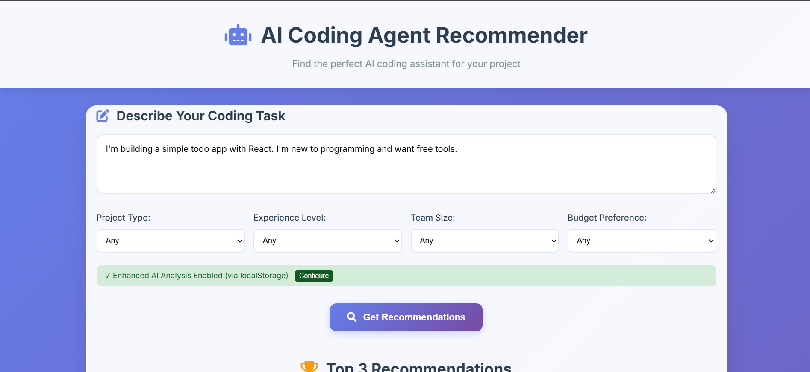

# AI Coding Agent Recommendation System

A smart web application that analyzes your coding tasks and recommends the best AI coding assistants based on your specific requirements, experience level, and project needs.



## Features

- **Natural Language Processing**: Describe your project in plain English
- **Smart Recommendations**: Get top 3 AI agents ranked by compatibility
- **Comprehensive Database**: 10+ popular coding agents with detailed analysis
- **Interactive Filtering**: Filter by project type, experience level, team size, and budget
- **Detailed Comparisons**: Side-by-side feature comparison tables
- **Responsive Design**: Works on desktop, tablet, and mobile devices
- **Real-time Analysis**: Instant recommendations as you type

## Supported AI Coding Agents

1. **GitHub Copilot** - AI pair programmer with excellent IDE integration
2. **Cursor** - AI-first code editor with advanced refactoring capabilities
3. **Replit AI** - Browser-based coding assistant with zero setup
4. **Amazon CodeWhisperer** - Enterprise-focused with AWS integration
5. **Tabnine** - Privacy-focused with on-premise options
6. **Codeium** - Completely free AI coding assistant
7. **Claude (Anthropic)** - Excellent for code analysis and explanations
8. **Sourcegraph Cody** - Powerful codebase understanding and search
9. **ChatGPT** - Versatile AI for coding tasks and learning
10. **Aider** - Terminal-based AI pair programmer with Git integration

## Quick Start

### Prerequisites

- Modern web browser (Chrome, Firefox, Safari, Edge)
- Local web server (optional, for best performance)

### Installation

1. **Download the project files**
   ```bash
   cd ai-agent-recommender/q2
   ```

2. **Option A: Simple File Opening**
   - Open `index.html` directly in your web browser
   
  
   

4. **Open in browser**
   - Navigate to `http://localhost:8000`
   - The application should load automatically

## Usage Guide

### Basic Usage

1. **Describe Your Project**
   - Enter a natural language description of your coding task
   - Example: "I need to build a React web app for e-commerce with a team of 3 developers"

2. **Set Filters (Optional)**
   - Choose project type (Web Development, Mobile, Data Science, etc.)
   - Select experience level (Beginner, Intermediate, Advanced)
   - Pick team size and budget preferences

3. **Get Recommendations**
   - Click "Get Recommendations" to analyze your requirements
   - View top 3 ranked AI agents with match percentages

4. **Compare Options**
   - Review detailed comparison table
   - Check all available agents in the comprehensive list
   - Click agent cards for more details

### Example Queries

**Beginner Web Developer:**
```
"I'm new to web development and want to build a simple portfolio website using HTML, CSS, and JavaScript. I prefer free tools and need good explanations."
```

**Data Science Team:**
```
"Working on a machine learning project with Python, pandas, and scikit-learn. Team of 5 experienced developers needs collaborative features and code review capabilities."
```

**Enterprise Backend:**
```
"Building a microservices architecture with Node.js and Docker for a large enterprise. Security, code quality, and team collaboration are priorities. Budget is not a constraint."
```

**Mobile Development:**
```
"Learning React Native to build my first mobile app. Want an AI assistant that can explain code and help me understand mobile development concepts."
```

## Technical Architecture

### Frontend Technologies
- **HTML5**: Semantic markup with accessibility features
- **CSS3**: Modern responsive design with animations
- **Vanilla JavaScript**: No framework dependencies for maximum compatibility

### Key Components

1. **Natural Language Processor**
   - Keyword extraction from task descriptions
   - Domain classification (web, mobile, data science, etc.)
   - Complexity assessment (beginner, intermediate, advanced)
   - Feature requirement detection

2. **Recommendation Engine**
   - Multi-factor scoring algorithm
   - Weighted scoring: Domain Match (30%), Complexity (25%), Features (25%), Accessibility (20%)
   - Real-time ranking and filtering

3. **Agent Knowledge Base**
   - JSON-based database with 10+ agents
   - Comprehensive feature matrices
   - Pricing, setup time, and compatibility data

### Scoring Algorithm

```javascript
AgentScore = (DomainMatch × 0.30) + 
            (ComplexityMatch × 0.25) + 
            (FeatureRelevance × 0.25) + 
            (Accessibility × 0.20)
```

- **Domain Match**: How well the agent supports your project type
- **Complexity Match**: Alignment with your experience level
- **Feature Relevance**: Match with detected requirements (real-time, debugging, etc.)
- **Accessibility**: Cost, learning curve, and ease of setup

## File Structure

```
q2/
├── index.html          # Main application interface
├── style.css           # Responsive CSS styling
├── script.js           # Recommendation engine logic
├── agents-db.json      # Agent knowledge database
└── README.md           # This documentation
```

## Customization

### Adding New Agents

1. **Edit `agents-db.json`**
   ```json
   {
     "id": "new-agent-id",
     "name": "Agent Name",
     "description": "Brief description",
     "strengths": ["strength1", "strength2"],
     "weaknesses": ["weakness1", "weakness2"],
     "domains": ["web development", "backend"],
     "complexity": ["beginner", "intermediate"],
     "features": {
       "realTime": true,
       "offline": false,
       "codeGeneration": 8,
       "debugging": 7
     },
     "pricing": "freemium",
     "cost": "$10/month",
     "ideSupport": ["VS Code", "JetBrains"]
   }
   ```

2. **Add Icon Mapping** in `script.js`:
   ```javascript
   const iconMap = {
     'new-agent-id': 'fas fa-icon-name'
   };
   ```

### Modifying Weights

Adjust the scoring weights in `script.js`:
```javascript
this.weights = {
    domainMatch: 0.30,      // Domain relevance
    complexityMatch: 0.25,  // Experience level fit
    featureRelevance: 0.25, // Feature requirements
    accessibility: 0.20     // Cost and ease of use
};
```

### Styling Customization

Key CSS variables for easy theming:
```css
:root {
    --primary-color: #667eea;
    --secondary-color: #764ba2;
    --success-color: #27ae60;
    --text-color: #2c3e50;
}
```

## Browser Compatibility

- Chrome 90+
- Firefox 88+
- Safari 14+
- Edge 90+

## Performance

- **Load Time**: < 2 seconds on average connection
- **Bundle Size**: ~50KB total (HTML + CSS + JS)
- **Database**: ~10KB agent data
- **Memory Usage**: < 5MB typical usage


## Future Enhancements

- [ ] User accounts and preferences
- [ ] Agent ratings and reviews
- [ ] Integration with agent APIs
- [ ] Code snippet examples
- [ ] Mobile app version
- [ ] More detailed filtering options
- [ ] Export recommendations to PDF
