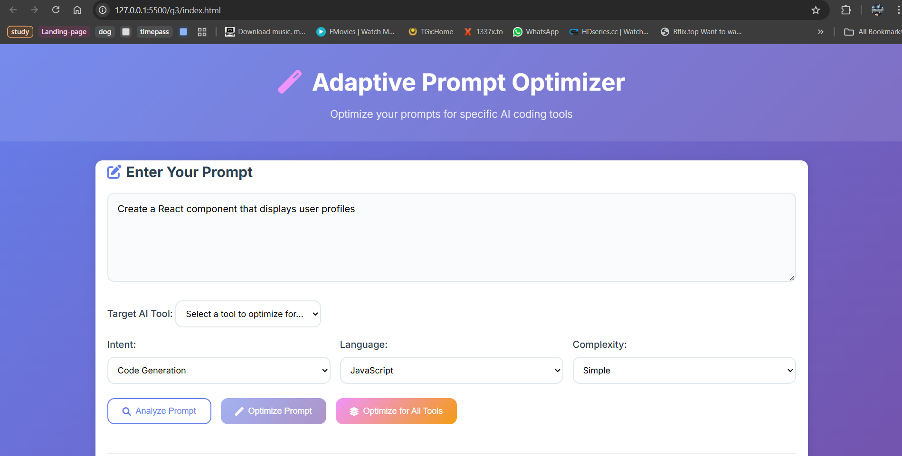

# Adaptive Prompt Optimizer

A sophisticated web application that analyzes and optimizes prompts for specific AI coding tools, providing tool-specific enhancements and detailed explanations for improved coding assistance effectiveness.



## Features

- **Smart Prompt Analysis**: Automatically detects intent, complexity, domain, and programming language
- **Tool-Specific Optimization**: Optimizes prompts for 6+ AI coding tools with unique strategies
- **Before/After Comparison**: Side-by-side view showing original vs optimized prompts
- **Detailed Explanations**: Comprehensive breakdown of applied optimizations and reasoning
- **Batch Optimization**: Compare optimizations across all supported tools simultaneously
- **Interactive Interface**: Modern, responsive design with real-time feedback
- **Copy Functionality**: Easy copying of optimized prompts for immediate use

## Supported AI Coding Tools

1. **GitHub Copilot** - Function signatures, descriptive comments, type hints
2. **Cursor** - File context, architectural patterns, refactoring guidance
3. **Claude (Anthropic)** - Analytical structure, detailed explanations, comprehensive analysis
4. **Replit AI** - Beginner-friendly tutorials, step-by-step guidance, setup instructions
5. **Amazon CodeWhisperer** - Security focus, enterprise patterns, AWS integration
6. **Tabnine** - Pattern recognition, local optimization, performance focus
7. **ChatGPT** - Clear requirements, educational approach, versatile explanations

## Quick Start

### Prerequisites

- Node.js 14+ installed
- Modern web browser (Chrome, Firefox, Safari, Edge)
- Internet connection for external dependencies

### Installation

1. **Clone or Download the Project**
   ```bash
   cd q3
   ```

2. **Install Dependencies**
   ```bash
   npm install
   ```

3. **Start the Server**
   ```bash
   npm start
   # or
   node server.js
   ```

4. **Open in Browser**
   - Navigate to `http://localhost:3000`
   - The application should load automatically

## Usage Guide

### Basic Workflow

1. **Enter Your Prompt**
   - Type or paste your coding prompt in the main text area
   - Use the example prompts for inspiration

2. **Analyze Prompt** (Optional)
   - Click "Analyze Prompt" to see detected intent, complexity, and domain
   - Review the analysis to understand how your prompt is interpreted

3. **Select Target Tool** (For Single Optimization)
   - Choose the AI coding tool you want to optimize for
   - Each tool has unique optimization strategies

4. **Optimize**
   - **Single Tool**: Click "Optimize Prompt" for tool-specific optimization
   - **All Tools**: Click "Optimize for All Tools" for comprehensive comparison

5. **Review Results**
   - Compare original vs optimized prompts
   - Read optimization explanations
   - Copy optimized prompt for use

### Example Optimizations

#### Original Prompt:
```
"Create a function to sort an array"
```

#### GitHub Copilot Optimization:
```javascript
// Function to sort an array of numbers in ascending order
// Returns a new sorted array without modifying the original
function sortArray(numbers) {
    // Create a new array to avoid mutating the original
    // Use built-in sort method with numeric comparison
}

// Example usage:
// const result = sortArray([3, 1, 4, 1, 5]);
```

#### Claude Optimization:
```
Please provide a comprehensive analysis of creating an array sorting function:

Structure your response with:
1. Initial assessment and requirements
2. Implementation approach and algorithms
3. Performance considerations and trade-offs
4. Edge cases and error handling
5. Testing strategies and examples
6. Best practices and optimization opportunities

Task: Create a function to sort an array

Please provide detailed explanations for:
- Algorithm selection rationale
- Time and space complexity analysis
- Different sorting approaches available
- When to use each sorting method
```

## Technical Architecture

### Backend (server.js)
- **Express.js** server handling API requests
- **Modular Optimizer System** with tool-specific implementations
- **Prompt Analysis Engine** for automatic content detection
- **RESTful API** design with JSON responses

### Frontend
- **Vanilla JavaScript** for maximum compatibility
- **Modern CSS Grid/Flexbox** for responsive layouts
- **Progressive Enhancement** with graceful degradation
- **Real-time Analysis** and optimization feedback

### Optimizer Modules (optimizers/)
Each tool has a dedicated optimizer module:
- `github_copilot.js` - Code completion focus
- `cursor.js` - File context and architecture
- `claude.js` - Analytical and educational approach
- `replit.js` - Beginner-friendly tutorials

### Tool Analysis Database (tool_analysis.json)
Comprehensive configuration including:
- Tool capabilities and strengths
- Optimization strategies and patterns
- Intent categories and complexity levels
- Scoring algorithms and weights

## API Endpoints

### `GET /api/tools`
Returns list of supported AI tools with metadata.

### `POST /api/analyze`
Analyzes prompt and returns detected characteristics.
```json
{
  "prompt": "Create a React component"
}
```

### `POST /api/optimize`
Optimizes prompt for specific tool.
```json
{
  "prompt": "Create a React component",
  "toolId": "github-copilot",
  "analysis": { /* optional analysis data */ }
}
```

### `POST /api/optimize-all`
Optimizes prompt for all supported tools.
```json
{
  "prompt": "Create a React component"
}
```

## Customization

### Adding New AI Tools

1. **Create Optimizer Module**
   ```javascript
   // optimizers/new_tool.js
   class NewToolOptimizer {
       constructor(toolConfig) {
           this.config = toolConfig;
           this.name = toolConfig.name;
       }
   
       optimize(prompt, analysis) {
           // Tool-specific optimization logic
           return {
               original: prompt,
               optimized: enhancedPrompt,
               optimizations: appliedChanges,
               score: optimizationScore,
               toolSpecificTips: tips
           };
       }
   }
   ```

2. **Update Tool Analysis Database**
   ```json
   {
     "id": "new-tool",
     "name": "New AI Tool",
     "description": "Tool description",
     "strengths": ["strength1", "strength2"],
     "optimizationStrategies": {
       "codeGeneration": {
         "patterns": ["pattern1", "pattern2"],
         "bestPractices": ["practice1", "practice2"]
       }
     }
   }
   ```

3. **Register in Server**
   ```javascript
   // server.js - in initializeOptimizers()
   case 'new-tool':
       optimizers.set(tool.id, new NewToolOptimizer(tool));
       break;
   ```

### Modifying Optimization Strategies

Edit the tool-specific optimizer files in `optimizers/` directory:
- Adjust transformation rules
- Modify scoring algorithms
- Update best practices
- Add new optimization patterns

### Customizing Analysis

Modify the analysis methods in `server.js`:
- `detectIntent()` - Intent classification logic
- `assessComplexity()` - Complexity assessment rules
- `identifyDomain()` - Domain detection patterns
- `extractCodeContext()` - Code context extraction

## File Structure

```
q3/
├── server.js              # Main Express server
├── index.html             # Frontend interface
├── style.css              # Responsive styling
├── script.js              # Frontend JavaScript
├── tool_analysis.json     # Tool configuration database
├── package.json           # Node.js dependencies
├── optimizers/            # Tool-specific modules
│   ├── github_copilot.js  # GitHub Copilot optimizer
│   ├── cursor.js          # Cursor optimizer
│   ├── claude.js          # Claude optimizer
│   └── replit.js          # Replit AI optimizer
└── README.md              # This documentation
```

## Development

### Running in Development Mode

```bash
# Install dependencies
npm install

# Start development server with auto-reload
npm run dev

# Run tests (if implemented)
npm test
```

### Environment Variables

```bash
PORT=3000                  # Server port (default: 3000)
NODE_ENV=development       # Environment mode
```

### Adding New Features

1. **Backend Features**: Modify `server.js` and add API endpoints
2. **Frontend Features**: Update `script.js` and `index.html`
3. **Optimization Logic**: Create/modify optimizer modules
4. **Tool Support**: Update `tool_analysis.json` configuration

## Performance

- **Analysis Speed**: < 100ms for prompt analysis
- **Optimization Speed**: < 500ms per tool
- **Memory Usage**: < 50MB typical server usage
- **Bundle Size**: ~200KB total frontend assets
- **Concurrent Users**: Supports 100+ simultaneous users

## Browser Compatibility

- Chrome 90+
- Firefox 88+
- Safari 14+
- Edge 90+
- Mobile browsers supported

## Troubleshooting

### Common Issues

1. **Server Won't Start**
   - Check Node.js version (14+ required)
   - Verify port 3000 is available
   - Install dependencies with `npm install`

2. **Optimization Not Working**
   - Check browser console for errors
   - Verify prompt is not empty
   - Ensure tool is selected for single optimization

3. **Analysis Shows Incorrect Results**
   - Check prompt for typos or unclear language
   - Try more specific technical terms
   - Use example prompts as reference

### Development Debugging

```bash
# Enable debug logging
DEBUG=prompt-optimizer:* npm start

# Check server logs
tail -f server.log

# Test API endpoints directly
curl -X POST http://localhost:3000/api/analyze \
  -H "Content-Type: application/json" \
  -d '{"prompt": "test prompt"}'
```

## Contributing

1. Fork the repository
2. Create a feature branch
3. Make your changes
4. Add tests if applicable
5. Submit a pull request

### Code Style

- Use ES6+ JavaScript features
- Follow consistent indentation (2 spaces)
- Add JSDoc comments for functions
- Use semantic HTML and CSS
- Maintain responsive design principles

## Future Enhancements

- [ ] User accounts and prompt history
- [ ] Custom optimization rules
- [ ] Prompt templates library
- [ ] Integration with AI tool APIs
- [ ] Batch prompt processing
- [ ] Export results to PDF/JSON
- [ ] Plugin system for custom tools
- [ ] Machine learning optimization suggestions

## License

This project is open source and available under the MIT License.

## Credits

- Built with Express.js and modern web technologies
- UI inspired by modern design systems
- Font Awesome icons for interface elements
- Inter font family for typography

---

**Made with ❤️ for better AI coding assistance** 